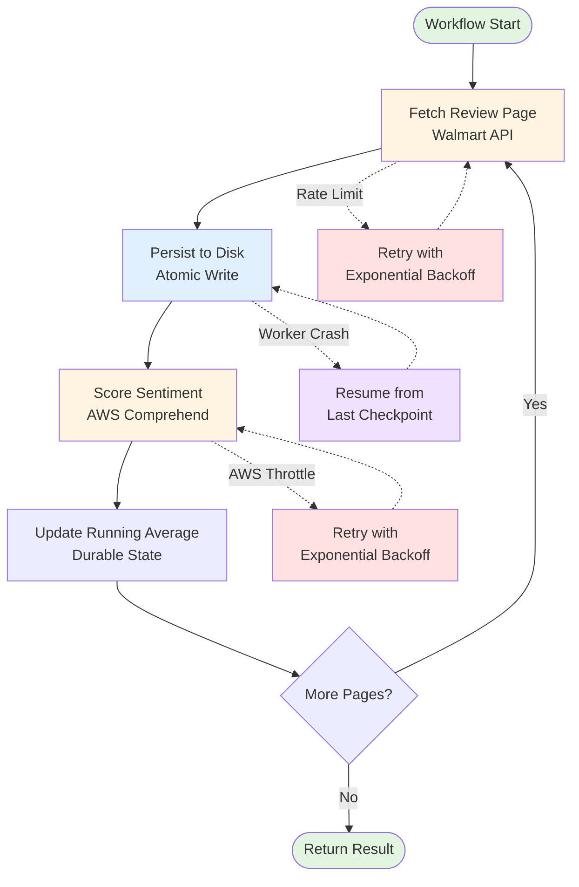

# Walmart Review Sentiment Analysis with Temporal

**Exercise Use Case**: _"A company wants to understand customer sentiment for one of their products. Write a pipeline that scrapes reviews of the product online and runs sentiment analysis on them. Average the sentiment scores to get an overall score for the product."_

## The Problem

Processing hundreds of product reviews across multiple services creates **four critical distributed systems challenges**:

1. **Failure Recovery** - API calls fail mid-processing (network, rate limits, service outages)
2. **State Coordination** - Managing progress across 100+ sequential API calls and two external services
3. **Retry Complexity** - Different retry strategies needed for different failure types (API vs sentiment analysis)
4. **Progress Visibility** - No insight into long-running workflow status without proper observability

**Traditional solutions fail**: A crash on page 87 of 100 means reprocessing all 86 previous pages, wasting API quota and time. Distributed locks and manual checkpointing are brittle and complex.

**Solution**: Durable Temporal execution with automatic retries, persistent state, and built-in observability. Workflows survive crashes and resume from the last successful operation.

## How It Works



**Workflow Steps**:
1. **Fetch** - Get one page of reviews from Walmart API (10 reviews/page)
2. **Persist** - Atomically save reviews to disk (survives worker crashes)
3. **Score** - Analyze sentiment with AWS Comprehend (batch processing)
4. **Update** - Maintain running weighted average in durable workflow state
5. **Repeat** - Continue until all pages processed or max reviews reached

### **1. Component Diagram**
Workflow Components and External Dependencies
```
┌─────────────┐
│   Worker    │
│  (Python)   │
└──────┬──────┘
       │ Polls for tasks
       ▼
┌─────────────┐      ┌──────────────┐
│  Temporal   │────> │  Activities  │
│   Server    │      │ • Fetch      │
└─────────────┘      │ • Score      │
                     └──────┬───────┘
                            │
              ┌─────────────┴────────────┐
              ▼                          ▼
       ┌──────────────┐       ┌───────────────┐
       │ Walmart API  │       │ AWS Comprehend│
       └──────────────┘       └───────────────┘
```

## Architecture & Design Decisions

### Core Temporal Patterns

**1. Activity Separation (Independent Retry Domains)**

Fetch and score operations are separate activities with distinct retry policies:

```python
# Walmart API fails → retry fetch without wasting AWS quota
page_meta = await workflow.execute_activity(get_reviews, ...)

# AWS throttles → retry score without re-fetching reviews  
score = await workflow.execute_activity(score_reviews, ...)
```

**Rationale**: Coupling these operations means Walmart API failures waste AWS Comprehend quota, and AWS throttling wastes Walmart API quota. Separation enables independent retry strategies.

**2. Temp File Storage (Event History Optimization)**

Review data flows between activities via disk storage, not Temporal's event history:

| Approach | Event History Size | Coupling | Scaling |
|----------|-------------------|----------|---------|
| Single activity | Small | ❌ High | Limited |
| Return via Temporal | ❌ 1MB+ | Low | ❌ Bloated |
| **Temp files** | Minimal | Low | Scalable |

**Rationale**: Temporal's event history is designed for metadata and state, not bulk data. Passing 100 pages × 10KB of review text bloats the history and degrades performance. See `storage.py` for full analysis.

**3. Sequential Processing (Simplicity vs Performance Trade-off)**

Pages are processed sequentially rather than concurrently:

**Current**: Simple, natural backpressure, predictable resource usage  
**Production**: Would use concurrent fetching (10-20 pages) or child workflows for independent page processing

**Rationale**: For this exercise, sequential processing clearly demonstrates Temporal patterns without the complexity of concurrent activity management. Comments in `workflows.py` explain production scaling approach.

### Technology Choices

**Walmart API vs Web Scraping**

Used Walmart's official Product API instead of scraping:
- **Focus**: Demonstrates Temporal patterns, not anti-bot evasion
- **Stability**: Public API with consistent responses
- **Simplicity**: No DOM parsing, CAPTCHA solving, or rate limit workarounds

**AWS Comprehend vs LLMs**

Purpose-built sentiment analysis instead of GPT/Claude:

| Metric | AWS Comprehend | LLM (GPT-4) |
|--------|---------------|-------------|
| Cost/review | $0.0001 | $0.01 (100x more) |
| Latency | ~10ms | ~2s (200x slower) |
| Determinism | Consistent | ⚠️ Prompt-dependent |
| Setup | API call | Prompt engineering |

**Rationale**: Comprehend provides exactly what's needed—fast, cheap, reliable sentiment scoring—without LLM complexity.

## Temporal Features Demonstrated

- **Durable Execution** - Workflows survive worker crashes and resume automatically
- **Activity Retries** - Configurable retry policies per activity (exponential backoff)
- **Workflow State** - Running average maintained durably across restarts
- **Queries** - Real-time progress monitoring without blocking execution
- **Signals** - Runtime workflow control (pause/resume)
- **Event History** - Complete audit trail of all operations
- **Deterministic Execution** - Predictable, testable workflow behavior

## Setup

### Prerequisites

- Python 3.11+
- Temporal Server
- Walmart API credentials
- AWS account with Comprehend access

### 1. Install Temporal CLI

```bash
# macOS
brew install temporal

# Or download from https://docs.temporal.io/cli
temporal server start-dev
```

Server runs on `localhost:7233`, Web UI on `http://localhost:8233`

### 2. Get API Credentials

**Walmart API**:
1. Register at [developer.walmart.com](https://developer.walmart.com/)
2. Create application → Generate API keys
3. Note: Consumer ID, Key Version, Private Key path

**AWS Comprehend**:
1. Create IAM user at [AWS IAM Console](https://console.aws.amazon.com/iam/)
2. Attach **ComprehendReadOnly** policy
3. Generate access keys (Access Key ID + Secret)

### 3. Configure Environment

```bash
cp .env.example .env
# Edit .env with your credentials
```

Required variables:
```bash
WM_CONSUMER_ID=your-consumer-id
WM_KEY_VERSION=1
WM_PRIVATE_KEY_PATH=/path/to/walmart-key.pem
AWS_ACCESS_KEY_ID=your-access-key
AWS_SECRET_ACCESS_KEY=your-secret-key
AWS_DEFAULT_REGION=us-west-2
```

### 4. Install Dependencies

```bash
pip install -e .
```

## Usage

### Run Workflows

**Terminal 1 - Start Worker**:
```bash
python -m review_sentiment.run_worker
```

**Terminal 2 - Execute Workflow**:
```bash
# Analyze product reviews (default: up to 10,000 reviews)
python -m review_sentiment.run_workflow 14977205582

# Limit to 50 reviews
python -m review_sentiment.run_workflow 14977205582 --max-reviews 50
```

**Example Output**:
```
===========================================================
Review Sentiment Analysis Result
============================================================
Product Name  : Samsung Galaxy S25 Ultra 256GB Unlocked Android Cell Phone with 200MP Camera, Titanium Blue
Sale Price    : $1049.99
Product URL   : https://www.walmart.com/ip/14977205582
Review Count  : 300
Avg Sentiment : 3.962 / 5.0
============================================================
```

### Workflow Management

**Query Progress** (non-blocking):
```bash
python -m review_sentiment.manage_workflow progress <workflow-id>
```

**Pause Workflow**:
```bash
python -m review_sentiment.manage_workflow pause <workflow-id>
```

**Resume Workflow**:
```bash
python -m review_sentiment.manage_workflow resume <workflow-id>
```

**Cancel Workflow**:
```bash
python -m review_sentiment.manage_workflow cancel <workflow-id>
```

**List Recent Workflows**:
```bash
python -m review_sentiment.manage_workflow list --limit 10
```

### Test Resilience

**Demonstrate fault tolerance**:
1. Start workflow: `python -m review_sentiment.run_workflow 14977205582 --max-reviews 100`
2. Kill worker mid-execution (Ctrl+C)
3. Wait 30 seconds
4. Restart worker: `python -m review_sentiment.run_worker`
5. Watch workflow resume from last completed page ✨

**Real-world validation**: During development, a power outage occurred mid-workflow. After restoration, the workflow completed successfully from its checkpoint—zero data loss, zero manual intervention.

### Monitor in Temporal UI

Visit [http://localhost:8233](http://localhost:8233) to inspect:
- Workflow execution history
- Activity retry attempts
- Event timeline and payloads
- Worker status

## Project Structure

```
review_sentiment/
├── models.py              # Dataclass parameters (Temporal best practice)
├── activities.py          # Fetch & score activities (retryable work)
├── workflows.py           # Workflow orchestration (durable state)
├── storage.py             # Atomic file operations for activity data
├── run_worker.py          # Worker process (polls for tasks)
├── run_workflow.py        # CLI to execute workflows
├── manage_workflow.py     # CLI for workflow control (query/signal/cancel)
├── walmart_client/
│   ├── api.py            # Walmart API client
│   └── signer.py         # RSA request signing
└── aws_client/
    └── comprehend.py     # AWS Comprehend sentiment analysis
```

## Key Implementation Notes

**Deterministic Workflow Code**: Workflows use `workflow.unsafe.imports_passed_through()` for activity imports to maintain determinism. No direct I/O, random numbers, or system time in workflow code.

**Dataclass Parameters**: All activities and workflows use single dataclass parameters (Temporal best practice) for future-proof versioning and backward compatibility.

**Atomic File Operations**: `storage.py` implements staging file + `os.replace()` for atomic writes, preventing partial corruption if workers crash during file writes.

**Retry Policies**: Exponential backoff (1s → 60s, 2x coefficient, 10 max attempts) balances fast recovery with rate limit respect.

**Weighted Average**: Maintains running sum rather than storing individual scores to keep workflow state compact (important for event history size).

---

**Built for Temporal Solutions Architect Technical Exercise** - Demonstrating durable execution patterns in real-world multi-service orchestration.